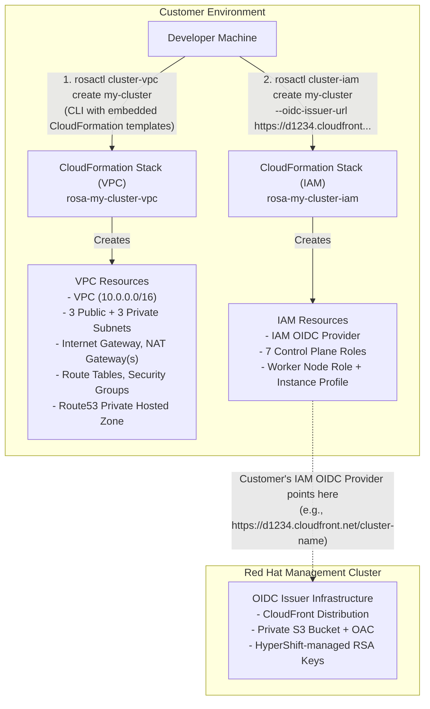
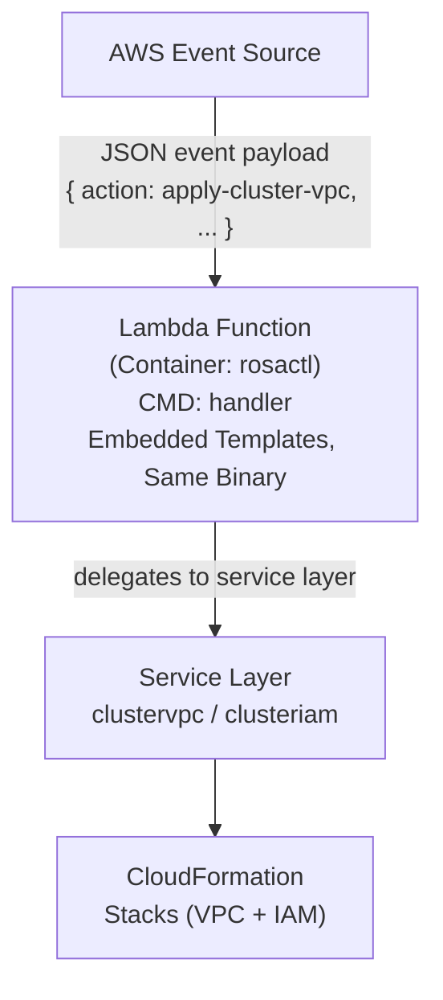

# System Architecture

## Overview

`rosactl` is a command-line tool for managing AWS infrastructure for ROSA Regional HCP (Hosted Control Plane) clusters. It provides direct CloudFormation management for VPC networking and IAM resources, with optional Lambda support for event-driven workflows.

## Architecture Principles

1. **Direct Execution**: CLI commands directly create CloudFormation stacks without requiring Lambda
2. **Embedded Templates**: CloudFormation templates embedded in binary for portability
3. **Declarative Infrastructure**: All resources defined in CloudFormation templates
4. **Optional Lambda**: Lambda available for automation but not required for basic operations
5. **Dual-Mode Binary**: Same binary can run as CLI or Lambda function
6. **Managed OIDC**: Uses Red Hat's CloudFront-backed OIDC issuer
7. **Transparency**: CloudFormation templates are auditable files in the repository

## High-Level Architecture

### Primary Mode: Direct CloudFormation



### Optional Mode: Lambda for Event-Driven Workflows

Lambda bootstrap is **optional** and used for CI/CD integration or event-driven automation. The same rosactl binary runs as a Lambda function via the `handler` subcommand.



## Components

### CLI Layer

Command-line interface built with Cobra framework.

**Cluster VPC Management**:
- `cluster-vpc create` - Create VPC networking via CloudFormation
- `cluster-vpc delete` - Delete VPC stack
- `cluster-vpc list` - List all VPC stacks

**Cluster IAM Management**:
- `cluster-iam create` - Create IAM resources (OIDC provider + roles)
- `cluster-iam delete` - Delete IAM stack
- `cluster-iam list` - List all IAM stacks

**Optional Lambda Bootstrap**:
- `bootstrap create` - Deploy Lambda container function via CloudFormation
- `handler` - Start the Lambda handler runtime (used as container CMD, hidden from help)

### Service Layer

Shared business logic used by both CLI commands and the Lambda handler:

- `internal/services/clustervpc` - `CreateVPC()` and `DeleteVPC()` functions
- `internal/services/clusteriam` - `CreateIAM()` and `DeleteIAM()` functions

The service layer accepts request structs with AWS config, making the same logic available to CLI commands and Lambda event handling without duplication.

### CloudFormation Client

Handles direct CloudFormation stack management including:
- Stack creation with parameters, tags, and capabilities
- Stack updates with automatic fallback from create failures
- Stack deletion with wait for completion
- Stack status monitoring and event retrieval
- Custom error types for graceful handling (AlreadyExists, NoChanges, NotFound)

### Template Management

CloudFormation templates embedded in binary using go:embed directive:
- `cluster-vpc.yaml` - VPC networking stack
- `cluster-iam.yaml` - IAM roles and OIDC provider stack
- `lambda-bootstrap.yaml` - Lambda function stack (optional)

Templates are read at runtime from embedded filesystem, ensuring single portable binary with no external dependencies.

### Crypto Layer

**TLS Thumbprint Fetching**:
Connects to OIDC issuer URL via HTTPS, extracts root CA certificate from TLS handshake, calculates SHA-1 fingerprint, and returns thumbprint for IAM OIDC provider creation.

**OIDC Domain Extraction**:
Validates and strips `https://` prefix from OIDC issuer URL for use in CloudFormation template parameters.

### Lambda Handler (Optional)

Event-driven execution mode invoked via `rosactl handler` (the container's default CMD).

**Supported event actions**:
- `apply-cluster-vpc` - Create VPC CloudFormation stack
- `delete-cluster-vpc` - Delete VPC stack
- `apply-cluster-iam` - Create IAM CloudFormation stack
- `delete-cluster-iam` - Delete IAM stack

**Event payload structure**:
```json
{
  "action": "apply-cluster-vpc",
  "cluster_name": "my-cluster",
  "availability_zones": ["us-east-1a", "us-east-1b", "us-east-1c"],
  "single_nat_gateway": true,
  "vpc_cidr": "10.0.0.0/16",
  "public_subnet_cidrs": ["10.0.101.0/24", "10.0.102.0/24", "10.0.103.0/24"],
  "private_subnet_cidrs": ["10.0.0.0/19", "10.0.32.0/19", "10.0.64.0/19"]
}
```

**Response structure**:
```json
{
  "action": "apply-cluster-vpc",
  "stack_id": "arn:aws:cloudformation:...",
  "outputs": { "VpcId": "vpc-...", "..." : "..." },
  "error": ""
}
```

The handler delegates to the service layer (`internal/services/clustervpc` and `internal/services/clusteriam`) for the actual CloudFormation operations.

## Data Flow

### VPC Creation Flow

1. User runs `rosactl cluster-vpc create my-cluster --region us-east-1`
2. CLI validates cluster name and CIDR ranges
3. CLI reads embedded VPC template
4. CLI loads AWS credentials and creates CloudFormation client
5. CLI calls CreateStack with VPC parameters (cluster name, CIDR blocks, AZs)
6. CloudFormation creates VPC resources (VPC, subnets, NAT gateways, etc.)
7. CLI waits for CREATE_COMPLETE status (15 minute timeout)
8. CLI displays stack outputs (VPC ID, subnet IDs, hosted zone ID)

### IAM Creation Flow

1. User runs `rosactl cluster-iam create my-cluster --oidc-issuer-url https://...`
2. CLI validates cluster name and OIDC URL format
3. CLI fetches TLS thumbprint from OIDC issuer URL
4. CLI derives OIDC domain by stripping `https://` prefix
5. CLI reads embedded IAM template
6. CLI loads AWS credentials and creates CloudFormation client
7. CLI calls CreateStack with IAM parameters (cluster name, OIDC URL, thumbprint)
8. CloudFormation creates IAM resources (OIDC provider, 7 control plane roles, worker role)
9. CLI waits for CREATE_COMPLETE status (15 minute timeout)
10. CLI displays stack outputs (all role ARNs, OIDC provider ARN)

### Stack Deletion Flow

1. User runs `rosactl cluster-iam delete my-cluster --region us-east-1`
2. CLI loads AWS credentials and creates CloudFormation client
3. CLI calls DeleteStack with stack name `rosa-my-cluster-iam`
4. CloudFormation deletes all resources in reverse dependency order
5. CLI waits for DELETE_COMPLETE status (15 minute timeout)
6. CLI displays success message

## Design Decisions

### Service Layer for Shared Logic

**Decision**: Extract VPC and IAM business logic into a dedicated service layer (`internal/services/`).

**Rationale**:
- CLI commands and Lambda handler share identical CloudFormation logic
- Single implementation means bug fixes and changes apply to both modes automatically
- Service functions accept request structs with `aws.Config`, making them independently testable
- Separation of concerns: CLI flag parsing vs. business logic vs. AWS API calls

### Direct CloudFormation vs Lambda Invocation

**Decision**: CLI commands directly call CloudFormation API; Lambda deployment is optional.

**Rationale**:
- Simpler user experience (no Lambda bootstrap required)
- Faster execution (no Lambda cold start delay)
- Direct CloudFormation error feedback
- Fewer AWS resources to manage
- Lower AWS costs for basic operations
- Lambda still available when event-driven execution is needed

### Embedded Templates with go:embed

**Decision**: Embed CloudFormation templates in binary using go:embed directive.

**Rationale**:
- Single portable binary with no external file dependencies
- No runtime file path resolution issues (embedded files accessed by name)
- Templates versioned with binary
- Works in any environment (local, container, Lambda)
- Embedded file reads can still fail if filename is wrong, but eliminates external path dependencies

**Trade-off**: Templates fixed at compile time (requires rebuild to update templates).

### CloudFormation for All Resources

**Decision**: All resources defined in CloudFormation templates, not direct SDK calls.

**Rationale**:
- Declarative infrastructure (GitOps-friendly)
- Automatic rollback on failure
- Drift detection available
- Change sets for previewing updates
- Stack-based lifecycle management
- Consistent with ROSA service model

**Trade-off**: Slower than direct SDK calls (stack creation ~2-5 minutes).

### Managed OIDC Only

**Decision**: No support for customer-hosted OIDC issuers.

**Rationale**:
- Aligns with ROSA HCP service architecture
- Simpler key management (HyperShift handles RSA keys)
- No RSA private keys in customer accounts
- No S3 buckets to manage in customer accounts
- Auto-fetch TLS thumbprint from OIDC URL

**Trade-off**: Requires Red Hat OIDC infrastructure to be available (no air-gapped support).

## Security Architecture

### IAM Permissions Required

**For CLI Execution**:
- **CloudFormation**: CreateStack, UpdateStack, DeleteStack, DescribeStacks, ListStacks, DescribeStackEvents
- **EC2** (VPC creation): CreateVpc, CreateSubnet, CreateSecurityGroup, CreateNatGateway, CreateInternetGateway, CreateRoute, CreateRouteTable
- **IAM** (cluster IAM): CreateRole, AttachRolePolicy, CreateInstanceProfile, CreateOpenIDConnectProvider
- **Route53** (VPC): CreateHostedZone, DeleteHostedZone

**For Lambda Execution** (optional):
- Same permissions as CLI execution
- Lambda: CreateFunction, DeleteFunction, InvokeFunction
- ECR: GetAuthorizationToken, BatchGetImage (for container images)

### OIDC Trust Chain

1. **HyperShift Operator** (Management Cluster) generates RSA key pair and stores in Kubernetes Secret
2. **Public Key Published** via CloudFront distribution backed by private S3 bucket
3. **Customer IAM OIDC Provider** created pointing to CloudFront URL with auto-fetched thumbprint
4. **Control Plane Pods** use ServiceAccount tokens signed by HyperShift to assume customer IAM roles
5. **Customer IAM Roles** trust OIDC provider with specific ServiceAccount conditions

### Stack Isolation

All CloudFormation stacks follow naming convention `rosa-{cluster-name}-{type}`:
- VPC stacks: `rosa-my-cluster-vpc`
- IAM stacks: `rosa-my-cluster-iam`

All stacks tagged with:
- `Cluster`: cluster name
- `ManagedBy`: rosactl
- `red-hat-managed`: true

## Monitoring & Observability

### CloudFormation Stack Events

Real-time stack events displayed during creation/deletion with:
- Progress indicators (emoji-based)
- Stack status polling with timeout
- Detailed error messages for failed resources
- Resource-level failure reasons

### CLI Output

Structured output format:
- Stack ID and status
- Resource outputs (VPC ID, role ARNs, etc.)
- Clear error messages with remediation suggestions
- Exit codes for automation (0 = success, non-zero = failure)

### CloudFormation Console

Users can view:
- Full stack history and drift detection
- Resource visualization
- Change sets for preview
- Stack events and status transitions

## Future Enhancements

1. CloudFormation change sets for safer updates before applying
2. Dry-run mode to preview resource changes
3. Multi-region support for replicating resources
4. Stack outputs export to file (JSON/YAML)
5. Template validation with cfn-lint integration
6. Rollback subcommand for failed stacks
7. Parallel stack management (create VPC and IAM concurrently)
8. Verbose logging flag for detailed AWS SDK output
9. Cost estimation before creating resources

## References

- [ROSA Regional Platform Terraform](https://github.com/openshift-online/rosa-regional-platform)
- [HyperShift OIDC Implementation](https://github.com/openshift/hypershift)
- [AWS CloudFormation Best Practices](https://docs.aws.amazon.com/AWSCloudFormation/latest/UserGuide/best-practices.html)
- [AWS Lambda Container Images](https://docs.aws.amazon.com/lambda/latest/dg/images-create.html)
- [AWS SDK for Go v2](https://aws.github.io/aws-sdk-go-v2/docs/)
