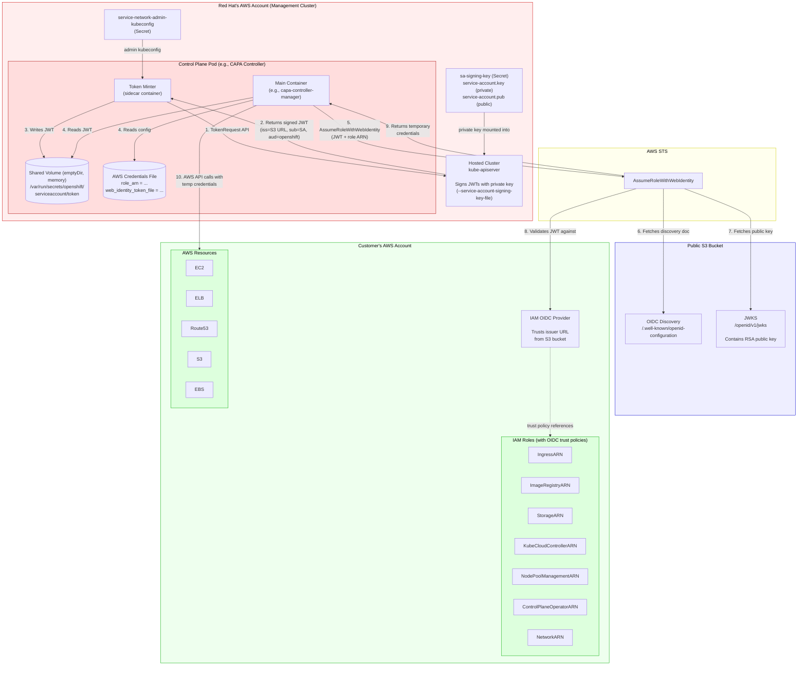
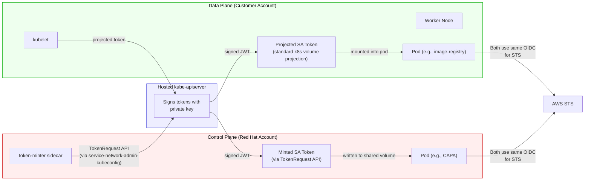
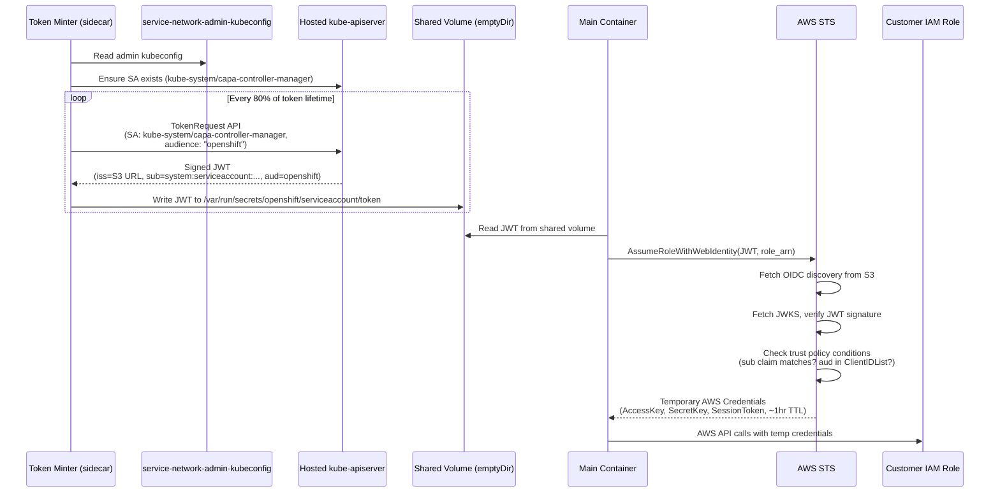
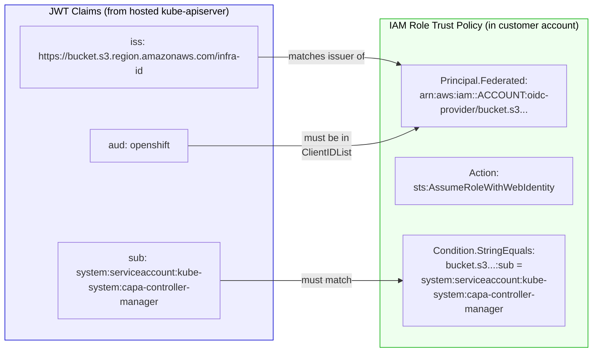

# OIDC/STS Cross-Account Authentication Flow in ROSA HCP

## The Problem

In ROSA HCP, the hosted control plane pods (kube-controller-manager, ingress operator, CAPA controller, etc.) run in **Red Hat's AWS account**. But they need to manage resources (EC2 instances, ELBs, Route53 records, S3 buckets, EBS volumes) in the **customer's AWS account**. The solution uses **AWS STS web identity federation** via an OIDC provider — no long-lived AWS credentials are ever shared.

## The Flow, Step by Step

### Step 0: A Keypair Is Generated

A RSA keypair (private + public) is created for the cluster. This keypair is the root of the entire trust chain.

- The **public key** will be published to a publicly accessible location so AWS STS can verify token signatures.
- The **private key** will be given to the hosted kube-apiserver so it can sign Kubernetes service account tokens.

---

### Step 1: The Public Key Is Made Available on S3

HyperShift generates two OIDC documents and uploads them to a **public S3 bucket** (AWS requires the public key to be publicly accessible so that STS can fetch and verify it):

1. **OpenID Connect Discovery Document** (`/.well-known/openid-configuration`) — tells AWS STS where to find the signing keys
2. **JWKS Document** (`/openid/v1/jwks`) — contains the RSA public key used to verify token signatures

> **Note:** In the ROSA managed service, CloudFront may sit in front of the S3 bucket as a CDN layer. The HyperShift codebase itself references S3 directly — the issuer URL points at the S3 bucket.

The code is in [`support/oidc/oidc.go`](support/oidc/oidc.go):

```json
{
  "issuer": "https://<bucket>.s3.<region>.amazonaws.com/<infra-id>",
  "jwks_uri": "https://<bucket>.s3.<region>.amazonaws.com/<infra-id>/openid/v1/jwks",
  "response_types_supported": ["id_token"],
  "subject_types_supported": ["public"],
  "id_token_signing_alg_values_supported": ["RS256"]
}
```

- The discovery document declares RS256 signing and `id_token` response type ([`support/oidc/oidc.go:64-78`](support/oidc/oidc.go#L64-L78)).
- The JWKS document publishes the public half of the RSA keypair with a SHA256-derived Key ID ([`support/oidc/oidc.go:29-62`](support/oidc/oidc.go#L29-L62)).

---

### Step 2: An IAM OIDC Provider Is Registered in the Customer's AWS Account

An AWS IAM OpenID Connect Provider is created in the customer's account, pointing at the S3-hosted issuer URL. This is the bridge that lets AWS STS trust tokens signed by the hosted cluster's kube-apiserver.

> **Note:** In the ROSA managed service, this step is orchestrated by the ROSA service backend (which may use Lambda or other automation). In self-managed HyperShift, the `hypershift` CLI does it directly. In the ROSA CLI flow, the customer runs `rosa create oidc-config`.

From [`cmd/infra/aws/iam.go:1009-1021`](cmd/infra/aws/iam.go#L1009-L1021):

```go
iamClient.CreateOpenIDConnectProvider(&iam.CreateOpenIDConnectProviderInput{
    ClientIDList: []*string{
        aws.String("openshift"),
        aws.String("sts.amazonaws.com"),
    },
    ThumbprintList: []*string{
        aws.String("A9D53002E97E00E043244F3D170D6F4C414104FD"), // DigiCert root CA
    },
    Url: aws.String(o.IssuerURL),
})
```

The two client IDs (`"openshift"` and `"sts.amazonaws.com"`) correspond to the token audiences used later.

---

### Step 3: IAM Roles With OIDC Trust Policies Are Created in the Customer Account

For each control plane component that needs AWS access, an IAM role is created in the customer's account. Each role has:

- A **permissions policy** (what AWS actions it can perform)
- A **trust policy** (who can assume it)

The trust policy uses the OIDC provider as a federated principal and restricts assumption to **specific Kubernetes service accounts** via the `sub` claim. This is critical — even if a token is validly signed by the OIDC issuer, it can only assume a role if the service account identity in the JWT matches the trust policy condition. From [`cmd/infra/aws/iam.go:1434-1451`](cmd/infra/aws/iam.go#L1434-L1451):

```json
{
  "Version": "2012-10-17",
  "Statement": [
    {
      "Effect": "Allow",
      "Principal": {
        "Federated": "<OIDC_PROVIDER_ARN>"
      },
      "Action": "sts:AssumeRoleWithWebIdentity",
      "Condition": {
        "StringEquals": {
          "<s3-bucket-domain>:sub": "system:serviceaccount:<namespace>:<sa-name>"
        }
      }
    }
  ]
}
```

The key roles (defined in [`api/hypershift/v1beta1/aws.go:434+`](api/hypershift/v1beta1/aws.go#L434)) include:

| Role                      | Purpose                                          |
| ------------------------- | ------------------------------------------------ |
| `IngressARN`              | Route53 + ELB operations                         |
| `ImageRegistryARN`        | S3 bucket operations for image registry          |
| `StorageARN`              | EBS volume operations                            |
| `KubeCloudControllerARN`  | EC2/ELB operations                               |
| `NodePoolManagementARN`   | CAPA controller (EC2 instances for worker nodes) |
| `ControlPlaneOperatorARN` | VPC endpoint operations                          |
| `NetworkARN`              | Network configuration                            |
| `KarpenterRoleARN`        | Karpenter auto-scaling (optional)                |

---

### Step 4: The Private Key Is Given to the Hosted kube-apiserver

The private key is stored as a Kubernetes secret referenced by `hc.Spec.ServiceAccountSigningKey` on the HostedCluster resource. The HyperShift Operator (HO) reconciler:

1. Reads the private key from this secret
2. Derives the public key from it
3. Writes both into a secret named `sa-signing-key` in the HCP (control plane) namespace, with keys `service-account.key` (private) and `service-account.pub` (public)

See [`hostedcluster_controller.go:4480-4501`](hypershift-operator/controllers/hostedcluster/hostedcluster_controller.go#L4480-L4501) and [`manifests.go:17-18`](hypershift-operator/controllers/manifests/controlplaneoperator/manifests.go#L17-L18).

The hosted kube-apiserver is then started with:

- `--service-account-signing-key-file` pointing at the private key ([`kas/config.go:259`](control-plane-operator/controllers/hostedcontrolplane/v2/kas/config.go#L259))
- `--service-account-issuer` set to the S3 OIDC URL ([`kas/config.go:253`](control-plane-operator/controllers/hostedcontrolplane/v2/kas/config.go#L253))

This means **all service account tokens** issued by this kube-apiserver are signed with the private key whose public counterpart is in the S3-hosted JWKS. Any such token is therefore verifiable by AWS STS via the OIDC provider.

---

### Step 5: Data Plane — Tokens Work Transparently

For pods running on **worker nodes in the data plane** (customer's account), this all works transparently. The kubelet on each worker node uses standard Kubernetes [service account token volume projection](https://kubernetes.io/docs/tasks/configure-pod-container/configure-service-account/#serviceaccount-token-volume-projection) to mount projected tokens into pods. These tokens are issued by the hosted kube-apiserver and signed with the same private key, so they are valid for the customer's OIDC provider. No special sidecar is needed.

---

### Step 6: Control Plane — The Token Minter Sidecar

Pods running in the **control plane** (Red Hat's management cluster) have a different problem. Their pod-level service account is a management cluster SA — issued by the management cluster's kube-apiserver, signed with a different key, and **not** trusted by the customer's OIDC provider.

HyperShift solves this with a **token-minter sidecar** ([`token-minter/tokenminter.go`](token-minter/tokenminter.go)) that runs alongside every control plane pod needing AWS access. This sidecar:

1. Connects to the **hosted cluster's** kube-apiserver using an admin kubeconfig from the `service-network-admin-kubeconfig` secret ([`aws.go:145`](hypershift-operator/controllers/hostedcluster/internal/platform/aws/aws.go#L145))
2. Ensures the target ServiceAccount exists in the hosted cluster (e.g., `kube-system/capa-controller-manager`)
3. Calls the Kubernetes `TokenRequest` API to mint a short-lived JWT for that service account, with audience `"openshift"`
4. Writes the JWT to a shared in-memory volume at `/var/run/secrets/openshift/serviceaccount/token`
5. Continuously refreshes the token at 80% of its lifetime (matching kubelet's renewal behavior)

From [`token-minter/tokenminter.go:195-204`](token-minter/tokenminter.go#L195-L204):

```go
treq := &authenticationv1.TokenRequest{
    Spec: authenticationv1.TokenRequestSpec{
        Audiences: []string{opts.tokenAudience},  // "openshift"
    },
}
token, err := clientset.CoreV1().ServiceAccounts(sa.GetNamespace()).CreateToken(
    ctx, sa.GetName(), treq, metav1.CreateOptions{})
```

The resulting JWT has:

- `iss` = the S3-hosted OIDC issuer URL
- `sub` = `system:serviceaccount:<namespace>:<name>`
- `aud` = `["openshift"]`
- Signed with the private key whose public counterpart is in the JWKS

---

### Step 7: AWS SDK Uses the Token for STS AssumeRoleWithWebIdentity

Each control plane pod has an AWS credentials file mounted that tells the AWS SDK to use web identity federation. From [`hypershift-operator/controllers/hostedcluster/internal/platform/aws/aws.go:34-39`](hypershift-operator/controllers/hostedcluster/internal/platform/aws/aws.go#L34-L39):

```ini
[default]
role_arn = arn:aws:iam::<customer-account>:role/<infra-id>-<component>
web_identity_token_file = /var/run/secrets/openshift/serviceaccount/token
sts_regional_endpoints = regional
region = us-east-1
```

When the AWS SDK in the pod needs credentials, it:

1. Reads the JWT from `web_identity_token_file`
2. Calls `STS:AssumeRoleWithWebIdentity` with the JWT and the `role_arn`
3. AWS STS fetches the OIDC discovery document from S3
4. AWS STS fetches the JWKS and verifies the JWT signature
5. AWS STS checks the trust policy on the IAM role: does the `sub` claim (service account) match the condition? Does the `aud` match a registered client ID?
6. If valid, STS returns temporary credentials (AccessKeyId, SecretAccessKey, SessionToken) valid for ~1 hour

The explicit STS call is also available in [`support/awsutil/sts.go`](support/awsutil/sts.go) for cases where the SDK's built-in credential chain isn't used.

---

### Step 8: Pod Accesses Customer AWS Resources

The pod now has temporary AWS credentials scoped to the specific IAM role in the customer's account. It uses these to make AWS API calls (create EC2 instances, manage Route53 records, etc.). The credentials expire and are automatically refreshed by the SDK re-reading the token file (which the token minter keeps fresh).

---

## Architecture Diagram



## Data Plane vs Control Plane Token Flow



## Token Minter Lifecycle



## Trust Policy Detail



## Why This Is Secure

1. **No long-lived credentials** — Only short-lived JWTs (~15 min) and temporary STS credentials (~1 hr) are used. Nothing is stored permanently.
2. **Least privilege** — Each component gets its own IAM role with only the permissions it needs.
3. **Service account scoping** — The trust policy `Condition` on the `sub` claim restricts which specific Kubernetes service accounts can assume each role. Even a validly signed token for a different SA will be rejected.
4. **Cryptographic verification** — AWS STS independently fetches the public key from S3 and verifies the JWT signature. No trust chain runs through Red Hat's infrastructure.
5. **Customer control** — The IAM roles and OIDC provider live in the customer's account. The customer can audit, restrict, or revoke them at any time.

## Key Source Files

| Component                              | File                                                                                                       | Lines          |
| -------------------------------------- | ---------------------------------------------------------------------------------------------------------- | -------------- |
| OIDC document generation               | [`support/oidc/oidc.go`](support/oidc/oidc.go)                                                             | 29-83          |
| OIDC provider creation                 | [`cmd/infra/aws/iam.go`](cmd/infra/aws/iam.go)                                                             | 988-1030       |
| Trust policy template                  | [`cmd/infra/aws/iam.go`](cmd/infra/aws/iam.go)                                                             | 1434-1451      |
| Private key reconciliation             | [`hostedcluster_controller.go`](hypershift-operator/controllers/hostedcluster/hostedcluster_controller.go) | 4480-4501      |
| SA signing key secret                  | [`manifests.go`](hypershift-operator/controllers/manifests/controlplaneoperator/manifests.go)              | 17-18          |
| KAS signing key flag                   | [`kas/config.go`](control-plane-operator/controllers/hostedcontrolplane/v2/kas/config.go)                  | 253-259        |
| Token minter                           | [`token-minter/tokenminter.go`](token-minter/tokenminter.go)                                               | 38-228         |
| CAPA deployment (token minter + creds) | [`aws.go`](hypershift-operator/controllers/hostedcluster/internal/platform/aws/aws.go)                     | 34-39, 140-259 |
| STS AssumeRole helper                  | [`support/awsutil/sts.go`](support/awsutil/sts.go)                                                         | —              |
| API role definitions                   | [`api/hypershift/v1beta1/aws.go`](api/hypershift/v1beta1/aws.go)                                           | 434+           |

## External Documentation

- [AWS: IAM OIDC Identity Providers](https://docs.aws.amazon.com/IAM/latest/UserGuide/id_roles_providers_oidc.html)
- [AWS: ROSA Getting Started with HCP](https://docs.aws.amazon.com/rosa/latest/userguide/getting-started-hcp.html)
- [Kubernetes: Service Account Token Volume Projection](https://kubernetes.io/docs/tasks/configure-pod-container/configure-service-account/#serviceaccount-token-volume-projection)
- [Kubernetes: TokenRequest API](https://kubernetes.io/docs/reference/kubernetes-api/authentication-resources/token-request-v1/)
